<div align="center">


[](https://github.com/Galidar/DeepSeekCode)

<br><br>


&nbsp;

&nbsp;

&nbsp;

&nbsp;

&nbsp;

&nbsp;

&nbsp;

&nbsp;

&nbsp;


</div>

<br>

## What is DeepSeek Code?

Most AI coding tools are **text chat in a box** — they can't touch your files, can't run commands, and forget everything after each session. Claude Code is powerful but burns through its 200K token context in 1-2 heavy tasks.

DeepSeek Code changes that equation entirely. It's a **self-evolving AI coding system** with its own file tools, shell access, knowledge base, persistent memory, and an **Intelligence Package** that learns from your corrections, debugs its own failures, resolves git conflicts, converts requirement docs into executable plans, and predicts tech debt before it becomes a problem — all powered by DeepSeek's **128K token** context window (V3.2).

Use it standalone from the terminal, or plug it into Claude Code so Claude can delegate the heavy code generation while keeping its own tokens free. The result? Claude orchestrates in ~5-15K tokens per task while DeepSeek does all the heavy lifting — **for free** with a web account — and gets smarter with every delegation.

```mermaid
graph TB
    CC["🧠 Claude Code — plans task, 5K tokens"]

    CC -->|"delegates"| SK["📚 51 Skills auto-injected"]
    CC -->|"delegates"| SM["🧬 Surgical Memory — project rules"]
    CC -->|"delegates"| GM["🌐 Global Memory — your code style"]

    SK --> DS["⚡ DeepSeek Code — 128K tokens, FREE"]
    SM --> DS
    GM --> DS

    DS --> TOOLS["🔧 15 MCP Tools — read, write, edit, run, resolve conflicts"]
    DS --> VAL["✅ Validates — truncation, TODOs, style"]
    DS --> INT["🔮 Intelligence Package — learns, predicts, debugs"]

    VAL -->|"pass"| RESULT["🏁 Code generated FREE — Claude tokens saved"]
    VAL -.->|"fail → root cause"| INT
    INT -.->|"targeted fix"| DS
    VAL -.->|"learn error"| SM

    style CC fill:#E87E04,stroke:#9A3412,color:#fff
    style SK fill:#8B5CF6,stroke:#6D28D9,color:#fff
    style SM fill:#EC4899,stroke:#BE185D,color:#fff
    style GM fill:#EC4899,stroke:#BE185D,color:#fff
    style DS fill:#4F46E5,stroke:#3730A3,color:#fff
    style TOOLS fill:#F59E0B,stroke:#B45309,color:#fff
    style VAL fill:#22C55E,stroke:#15803D,color:#fff
    style INT fill:#EF4444,stroke:#B91C1C,color:#fff
    style RESULT fill:#065F46,stroke:#047857,color:#fff
```

<br>

<div align="center">



</div>

<br>

<div align="center">


</div>

<br>

<details>
<summary><b>📊 Token breakdown for a typical delegation</b></summary>

<br>

Every delegation returns a precise token report so you always know where the budget goes:

```json
{
  "token_usage": {
    "skills_injected": 35000,
    "system_prompt": 7000,
    "template": 3000,
    "surgical_briefing": 1200,
    "global_briefing": 500,
    "total_input": 46950,
    "context_remaining": 81050,
    "context_used_percent": "36.7%"
  }
}
```

63% of DeepSeek's 128K context still available after a typical delegation. Claude only spent ~5-15K of its own 200K to orchestrate.

| | Claude Alone | Claude + DeepSeek Code |
|:--|:-----------:|:---------------------:|
| **Claude tokens per task** | 120K - 180K | **5K - 15K** (orchestration only) |
| **Code generation context** | 200K (shared with everything) | **128K dedicated** (DeepSeek) |
| **Code generation cost** | Your Claude tokens | **Free** (DeepSeek web) |
| **Session reuse savings** | N/A | **99.8%** — only new context sent |
| **Remembers past mistakes** | No | **Yes** — dual memory |
| **Validates its own output** | No | **Yes** — auto-retry on errors |

</details>

<br>


<br>

## Not Just Delegation — A Complete System

DeepSeek Code isn't a simple proxy to an API. It's a full coding environment with **15 native tools**, **51 knowledge skills**, **self-evolving intelligence**, and **8 distinct operation modes**.

```mermaid
graph TB
    User(["👤 You — describe your task"])

    User -->|"python run.py"| DS["⚡ DeepSeek Code<br/>128K tokens · FREE · standalone"]
    User -->|"via Claude Code plugin"| CC["🧠 Claude Code<br/>200K tokens · orchestrates"]

    CC -->|"/delegate — single task"| DEL["📋 Oneshot<br/>auto-validates, retries ×3"]
    CC -->|"/quantum — dual parallel"| QB["⚡ Quantum Bridge<br/>2 sessions, 3-way merge"]
    CC -->|"/multi-step — complex plans"| MS["📊 Multi-Step<br/>sequential + parallel groups"]
    CC -->|"/converse — iterative"| CV["💬 Conversational<br/>shared thinking, multi-turn"]

    DEL --> DS
    QB -->|"angle α"| DSA["⚡ DeepSeek α<br/>e.g. backend logic"]
    QB -->|"angle β"| DSB["⚡ DeepSeek β<br/>e.g. frontend render"]
    DSA -->|"merge result"| QB
    DSB -->|"merge result"| QB
    MS --> DS
    CV --> DS

    DS --> TOOLS["🔧 15 MCP Tools<br/>read · write · edit · run · resolve conflicts"]
    DS --> SKILLS["📚 51 Skills<br/>TF-IDF semantic matching + Bayesian boost"]
    DS --> MEM["🧬 Dual Memory<br/>surgical per-project + global cross-project"]
    DS --> INTEL["🔮 Intelligence Package<br/>shadow learning · debugging · prediction"]
    DS --> AGENT["🤖 Autonomous Agent<br/>up to 100 self-correcting steps"]
    DS --> SERENA["🔍 Serena<br/>LSP + regex code navigation"]

    style User fill:#6B7280,stroke:#374151,color:#fff
    style CC fill:#E87E04,stroke:#9A3412,color:#fff
    style DS fill:#4F46E5,stroke:#3730A3,color:#fff
    style DSA fill:#4F46E5,stroke:#3730A3,color:#fff
    style DSB fill:#4F46E5,stroke:#3730A3,color:#fff
    style DEL fill:#0EA5E9,stroke:#0369A1,color:#fff
    style QB fill:#7C3AED,stroke:#5B21B6,color:#fff
    style MS fill:#0EA5E9,stroke:#0369A1,color:#fff
    style CV fill:#10B981,stroke:#047857,color:#fff
    style TOOLS fill:#F59E0B,stroke:#B45309,color:#fff
    style SKILLS fill:#F59E0B,stroke:#B45309,color:#fff
    style MEM fill:#EC4899,stroke:#BE185D,color:#fff
    style INTEL fill:#EF4444,stroke:#B91C1C,color:#fff
    style AGENT fill:#EF4444,stroke:#B91C1C,color:#fff
    style SERENA fill:#8B5CF6,stroke:#6D28D9,color:#fff
```

<br>

<div align="center">



</div>

<br>


<br>

## 15 Real Tools, Not Just Chat

Every tool runs through the **MCP protocol** (JSON-RPC 2.0) with path sandboxing and command whitelisting. DeepSeek doesn't just suggest code — it reads your files, writes the changes, runs your build, resolves your merge conflicts, and checks the output.

| Category | Tools | What They Do |
|:--------:|:-----:|:------------|
| **File I/O** | `ReadFile` `WriteFile` `EditFile` `CopyFile` `MoveFile` `DeleteFile` | Full file system access with surgical line-level editing |
| **Navigation** | `ListDirectory` `FindFiles` `FileInfo` `MakeDirectory` | Search by pattern, get metadata, create paths |
| **System** | `RunCommand` `Archive` `Memory` `ManageKeys` | Shell execution, ZIP/TAR, persistent notes, API key rotation |
| **Intelligence** | `ResolveConflicts` | AI-powered git merge conflict detection and resolution |

All sandboxed with configurable `allowed_paths` and `allowed_commands`.

<br>


<br>

## 51 Skills — Semantic TF-IDF Matching

DeepSeek Code carries **51 specialized knowledge files** (49 `.skill` + 2 `.yaml` workflows) covering everything from SOLID principles to Canvas-2D physics to procedural generation. Skills are now selected by **TF-IDF cosine similarity** (not just keywords), with Bayesian success-rate boosting from GlobalMemory. They're organized in three tiers with an 80K token budget:

```mermaid
graph LR
    TASK["📝 Your task description"] -->|"TF-IDF vectorize"| MAP["🧠 Semantic Skill Index<br/>cosine similarity + Bayesian boost"]

    MAP -->|"always loaded"| CORE["🔵 Core Skills — 15K tokens<br/>SOLID, clean-code, error-handling,<br/>security, advanced-coding"]
    MAP -->|"top-K by similarity"| DOMAIN["🟣 Domain Skills — 45K tokens<br/>canvas-2d, physics-engine,<br/>game-genre, web-audio-api..."]
    MAP -->|"if budget remains"| SPEC["🟡 Specialist Skills — 20K tokens<br/>procedural-generation,<br/>multiplayer-sync, shaders..."]

    CORE --> PROMPT["⚡ Enriched prompt<br/>up to 80K of domain knowledge"]
    DOMAIN --> PROMPT
    SPEC --> PROMPT

    style TASK fill:#6B7280,stroke:#374151,color:#fff
    style MAP fill:#8B5CF6,stroke:#6D28D9,color:#fff
    style CORE fill:#3B82F6,stroke:#1D4ED8,color:#fff
    style DOMAIN fill:#7C3AED,stroke:#5B21B6,color:#fff
    style SPEC fill:#F59E0B,stroke:#B45309,color:#fff
    style PROMPT fill:#4F46E5,stroke:#3730A3,color:#fff
```

<div align="center">



</div>

You don't pick skills manually. A **Semantic Skill Index** (TF-IDF + cosine similarity) matches your task description to the right knowledge automatically. Skills with higher Bayesian success rates get boosted. Ask to "build a platformer with physics" and it injects `canvas-2d`, `physics-engine`, `game-genre`, and `procedural-generation` — without you doing anything. Falls back to keyword matching if needed.

<br>


<br>

## Memory That Makes It Smarter Over Time

This is what separates DeepSeek Code from every other AI coding tool: **it remembers its mistakes and learns from them**.

```mermaid
graph TB
    T1["🔴 Task 1 — 3 errors<br/>truncation, missing TODO, innerHTML"] --> SM["🧬 Surgical Memory<br/>captures per-project errors<br/>30 rules · 20 history · 15 patterns"]
    T1 --> GM["🌐 Global Memory<br/>captures cross-project patterns<br/>code style · skill success rates"]

    SM -->|"3K briefing injected"| T2["🟡 Task 2 — 1 error<br/>remembers innerHTML rule<br/>fills all TODOs correctly"]
    GM -->|"2K briefing injected"| T2

    T2 --> SM2["🧬 Surgical Memory<br/>new pattern learned"]
    T2 --> GM2["🌐 Global Memory<br/>EMA smoothing (α=0.15)"]

    SM2 -->|"fully adapted"| T3["🟢 Task 3 — 0 errors<br/>knows your project rules<br/>matches your code style"]
    GM2 -->|"fully adapted"| T3

    style T1 fill:#EF4444,stroke:#B91C1C,color:#fff
    style SM fill:#EC4899,stroke:#BE185D,color:#fff
    style GM fill:#EC4899,stroke:#BE185D,color:#fff
    style T2 fill:#F59E0B,stroke:#B45309,color:#fff
    style SM2 fill:#EC4899,stroke:#BE185D,color:#fff
    style GM2 fill:#EC4899,stroke:#BE185D,color:#fff
    style T3 fill:#22C55E,stroke:#15803D,color:#fff
```

<div align="center">



</div>

<br>

Two memory systems work together:

- **Surgical Memory** — learns errors **per project** with **semantic relevance search**. Uses `temporal_decay(age) * frequency` to rank entries — recent and frequent data dominates. `find_relevant(query)` searches entries by TF-IDF similarity. Smart compaction purges by relevance instead of FIFO. Stores up to 30 errors, 20 history entries, 15 patterns, 20 rules. Injects a 3K token briefing.

- **Global Memory** — learns patterns **across all your projects** with **Bayesian inference**. Each skill gets a `BayesianEstimator(Beta distribution)` with confidence intervals. Cross-project errors use semantic clustering (merge if cosine similarity > 0.6). Compaction uses `temporal_decay * count` weighting. Tracks code style, skill success rates, complexity sweet spots, mode performance, and recurring errors. Injects a 2K token briefing.

Both are fail-safe: if anything goes wrong, they return empty without interrupting your workflow.

<br>


<br>

## Persistent Sessions & Knowledge Transfer

Every DeepSeek chat is an independent **"sponge"** that absorbs knowledge. The v2.6 Session Orchestrator tracks what each session knows and only sends **new** context — cutting repeat-call tokens by 99.8%.

```mermaid
graph TB
    ORCH["🎯 Session Orchestrator<br/>decides what each chat needs"]

    ORCH -->|"1st call: full context"| S1["💬 delegate:auth-module<br/>92K tokens invested<br/>knows: JWT, bcrypt, middleware"]
    ORCH -->|"2nd call: only new message"| S1
    ORCH -->|"new session"| S2["💬 converse:api-design<br/>fresh session"]

    S1 -->|"--transfer-from"| KT["🔄 Knowledge Transfer<br/>compact summary injection"]
    KT -->|"topic + decisions + skills"| S2

    S1 --> SUM["📊 Auto-Summary<br/>0 extra tokens, local heuristics"]
    S2 --> SUM

    SUM --> DIGEST["📋 --session-digest<br/>routing decisions for Claude"]

    style ORCH fill:#06B6D4,stroke:#0E7490,color:#fff
    style S1 fill:#4F46E5,stroke:#3730A3,color:#fff
    style S2 fill:#4F46E5,stroke:#3730A3,color:#fff
    style KT fill:#F59E0B,stroke:#B45309,color:#fff
    style SUM fill:#8B5CF6,stroke:#6D28D9,color:#fff
    style DIGEST fill:#22C55E,stroke:#15803D,color:#fff
```

<div align="center">



</div>

<br>

Key features:

- **Phase 2 Injection** — Skills, memory, and knowledge are sent as individual tracked messages. Each session remembers what it already received — no duplication.
- **Knowledge Transfer** — `--transfer-from "delegate:auth"` injects a compact summary of another session's decisions into a new chat. Tracked bidirectionally.
- **Auto-Summaries** — After each exchange, local heuristics classify the activity (code/design/fix/query) and update the session's topic and summary at zero token cost.
- **Routing Digest** — `--session-digest` outputs JSON of all active sessions with topics, summaries, skills, and tokens invested — so Claude can route messages intelligently.
- **Interactive Chat Management** — `/new`, `/chats`, `/switch`, `/close` commands in the interactive CLI for managing multiple concurrent DeepSeek conversations.

```bash
# Check all active sessions
python run.py --session-digest

# Delegate with session persistence
python run.py --delegate "create auth" --session "auth-module" --json

# Transfer knowledge to a new session
python run.py --delegate "create API" --session "api" --transfer-from "delegate:auth-module" --json
```

<br>


<br>

## Intelligence Package — The AI That Evolves

This is what no other AI coding tool has. Five features that transform DeepSeek Code from a code generator into a **self-evolving intelligence**:

```mermaid
graph TB
    FAIL["❌ Delegation fails"] --> DBG["🔍 Introspective Debugger<br/>root cause analysis, not blind retry"]
    DBG -->|"targeted fix strategy"| RETRY["✅ Smart retry succeeds"]

    COMMIT["📝 User commits corrections"] --> SHADOW["👁️ Shadow Learner<br/>detects patterns via git diff"]
    SHADOW -->|"injects learned rules"| NEXT["⚡ Next delegation<br/>already knows your preferences"]

    MERGE["⚔️ Git merge conflict"] --> GIT["🔧 Git Intelligence<br/>AI-powered conflict resolution"]
    GIT -->|"resolve with context"| CLEAN["✅ Clean merge"]

    REQS["📋 Requirements doc"] --> PARSE["📊 Requirements Pipeline<br/>topological sort + parallel groups"]
    PARSE -->|"auto-execute"| PLAN["🚀 Multi-step plan runs"]

    HEALTH["🏥 Health report request"] --> PRED["🔮 Predictive Intelligence<br/>tech debt · LOC risks · error clusters"]
    PRED -->|"prioritized actions"| SAFE["💚 Project stays healthy"]

    style FAIL fill:#EF4444,stroke:#B91C1C,color:#fff
    style DBG fill:#F59E0B,stroke:#B45309,color:#fff
    style RETRY fill:#22C55E,stroke:#15803D,color:#fff
    style COMMIT fill:#6B7280,stroke:#374151,color:#fff
    style SHADOW fill:#8B5CF6,stroke:#6D28D9,color:#fff
    style NEXT fill:#4F46E5,stroke:#3730A3,color:#fff
    style MERGE fill:#EF4444,stroke:#B91C1C,color:#fff
    style GIT fill:#0EA5E9,stroke:#0369A1,color:#fff
    style CLEAN fill:#22C55E,stroke:#15803D,color:#fff
    style REQS fill:#6B7280,stroke:#374151,color:#fff
    style PARSE fill:#7C3AED,stroke:#5B21B6,color:#fff
    style PLAN fill:#4F46E5,stroke:#3730A3,color:#fff
    style HEALTH fill:#6B7280,stroke:#374151,color:#fff
    style PRED fill:#EC4899,stroke:#BE185D,color:#fff
    style SAFE fill:#22C55E,stroke:#15803D,color:#fff
```

<br>

<div align="center">



</div>

<br>

| Feature | What It Does | How It Works |
|:-------:|:------------|:------------|
| **🔍 Introspective Debugging** | When a delegation fails, analyzes the **root cause** instead of blind retry | Correlates with error history, identifies patterns (truncation, missing TODOs), generates targeted fix strategies with confidence scores |
| **👁️ Shadow Learning** | Learns from your **manual corrections** automatically | Compares DeepSeek's output with what you actually committed via `git diff`. Detects 7 correction patterns and injects them into future delegations |
| **🔧 Git Intelligence** | Resolves **merge conflicts** with AI context | MCP tool `resolve_conflicts` with detect/preview/resolve actions. Heuristic fallback + AI resolution with full project context |
| **📊 Requirements Pipeline** | Converts a **requirements document** into an executable plan | Parses markdown, detects priorities (MUST/SHOULD/COULD) and dependencies, generates topologically-sorted multi-step plans |
| **🔮 Predictive Intelligence** | Detects **tech debt** with Bayesian composite risk scoring | Bayesian risk score (0-100) combining failure rates, Mann-Kendall trend slopes, and file/debt indicators. Includes 95% confidence intervals and trend direction analysis |

```bash
# Convert requirements doc to executable plan
python run.py --requirements features.md --auto-execute --json

# Get predictive health report
python run.py --health-report --json
```

All five features are **fail-safe** — if any intelligence module errors, the main delegation flow continues without interruption. They're not bolted on; they're woven into every delegation cycle.

<br>


<br>

## Eight Ways to Work

<br>

**🖥️ Interactive CLI** — Full terminal experience with Rich UI, all commands, and persistent chat history.
```bash
python run.py
```

<br>

**📋 Oneshot Delegation** — Send a task, optionally with a template. DeepSeek fills the TODOs and returns complete, validated code. If the response gets truncated, it auto-continues up to 3 times. Use `--session` for persistence and `--transfer-from` for cross-chat knowledge.
```bash
python run.py --delegate "implement inventory system" --template inventory.ts --json
python run.py --delegate "add sorting" --session "inventory" --transfer-from "delegate:auth" --json
```

<br>

**⚡ Quantum Bridge** — The most powerful mode. 2 DeepSeek sessions attack the same task from different angles simultaneously (e.g., "backend logic" and "frontend render"). Auto-selects `deepseek-reasoner` for complex tasks (64K output including chain-of-thought). Results are auto-merged using a 3-strategy cascade: TODO-block matching → function extraction → raw concatenation. Large templates are automatically chunked to prevent hallucination.
```bash
python run.py --quantum "create combat system" --quantum-angles "logic,render" --json
```

<br>

**📊 Multi-Step** — Feed a JSON plan with sequential or parallel steps. Each step can depend on outputs from previous steps. Optional dual mode per step.
```bash
python run.py --multi-step plan.json --json
```

<br>

**💬 Conversational** — Iterative multi-turn dialogue where Claude and DeepSeek think together. Each message maintains full history. Build incrementally. Sessions persist across invocations.
```bash
python run.py --converse "build the audio system" --session "audio" --json
python run.py --converse "add spatial audio" --session "audio" --json
```

<br>

**🤖 Autonomous Agent** — Give it a goal. It plans, executes tools, self-corrects, and iterates up to 100 steps autonomously.
```bash
> /agent build a REST API with authentication, CRUD endpoints, and tests
```

<br>

**📋 Requirements Pipeline** — Feed a requirements document. DeepSeek parses it, detects priorities and dependencies, generates a topologically-sorted plan, and optionally executes it automatically.
```bash
python run.py --requirements features.md --auto-execute --json
```

<br>

**🔮 Health Report** — Predictive intelligence that scans your project for tech debt, LOC risks, error clusters, and worsening trends. Outputs prioritized recommendations.
```bash
python run.py --health-report --json
```

<br>


<br>

## Validation That Catches Mistakes Before You Do

Every response passes through a validation engine that checks for:

- **Truncation** — unclosed braces, incomplete functions, mid-sentence cuts → triggers auto-continuation (up to 3 rounds)
- **Missing TODOs** — if the template had `// TODO: implement X` and it wasn't filled → triggers retry with feedback
- **Code style violations** — enforces your project's rules from `CLAUDE.md` → logs the error to Surgical Memory for next time

Errors aren't just caught — they're **analyzed**. The Introspective Debugger identifies root causes, correlates with historical patterns, and generates targeted fix strategies. The next delegation won't make the same mistake — and neither will the one after that.

<br>


<br>

## V3.2 Intelligence — Auto-Select Model, Thinking Mode, Smart Chunking

DeepSeek Code now adapts to the difficulty of each task automatically:

| Feature | What It Does |
|:-------:|:------------|
| **Auto Model Select** | Simple questions use `deepseek-chat` (8K output). Complex code uses `deepseek-reasoner` (64K output + chain-of-thought) — selected automatically |
| **Thinking Mode** | Web sessions can enable DeepSeek's thinking mode for deeper reasoning on code tasks |
| **Smart Chunking** | Templates over 30K tokens are split by TODO blocks to prevent hallucination. Each chunk gets context from the previous one |
| **Dual Sessions** | Quantum Bridge runs 2 parallel sessions with different angles. Pool infrastructure (`create_pool_clients`) available for future scaling |
| **Adaptive max_tokens** | Output budget scales with task complexity: 1K for chat, 4K for simple code, 16K for delegations |

All features are backward-compatible — old configs work identically without changes.

<br>


<br>

## Security Built In, Not Bolted On

| Protection | How It Works |
|:----------:|:------------|
| **DPAPI Encryption** | All credentials encrypted at rest using Windows Data Protection API |
| **Path Sandboxing** | Tools can only access directories in your `allowed_paths` whitelist |
| **Command Whitelist** | Shell tool only runs commands from `allowed_commands` |
| **Rate Limiting** | 50 API calls per 60 seconds — prevents runaway loops |
| **Token Monitor** | Background health check every 5 minutes with auto-recovery |
| **Multi-Account** | Save, switch, and remove DeepSeek accounts without restart |

Two authentication modes:

| Mode | How | Cost |
|:----:|:----|:----:|
| **Web** | Qt WebEngine login → PoW challenge via WASM sha3 → Bearer + Cookies captured via JS intercept | **Free** |
| **API** | Standard key from platform.deepseek.com | Paid |

<br>


<br>

## Also Includes

**🧠 Semantic Engine** — Pure-Python central engine powering all subsystems. TF-IDF vectorization with bigrams, cosine similarity for semantic matching, Bayesian Beta distribution for confidence-aware learning, exponential temporal decay for time-weighted relevance, and Mann-Kendall trend detection for monotonic pattern analysis. Zero external dependencies.

**🔮 Intelligence Package** — 5 features powered by the Semantic Engine: introspective debugging (root cause analysis), shadow learning (learns from your git corrections), git conflict resolution (AI-powered MCP tool), requirements pipeline (document to plan), predictive intelligence (Bayesian composite risk with confidence intervals).

**🔍 Serena** — Symbolic code navigation with two modes: external `serena-agent` (LSP-powered) or a built-in regex engine that extracts classes, functions, and methods across Python, JavaScript, TypeScript, Java, Go, and Rust.

**🌐 i18n** — 155 translation keys across English (full), Spanish (full), and Japanese (36 keys + automatic English fallback). Language selector on first run, switchable anytime with `/lang`.

**🖥️ 17 CLI commands** — `/agent`, `/skill`, `/skills`, `/serena`, `/login`, `/logout`, `/health`, `/account`, `/keys`, `/test`, `/lang`, `/chat`, `/chats`, `/new`, `/switch`, `/close`, `/exit`

<br>


<br>

## Get Started

```bash
pip install PyQt5 PyQtWebEngine aiofiles requests
python run.py
```

First run: choose your language → log in with your DeepSeek account → start coding.

<br>

## Claude Code Plugin

If you use Claude Code, install the native plugin to delegate directly from Claude:

```bash
# Windows
Copy-Item -Recurse plugin\* "$env:USERPROFILE\.claude\plugins\marketplaces\local-desktop-app-uploads\deepseek-code\" -Force

# Linux/macOS
cp -r plugin/ ~/.claude/plugins/marketplaces/local-desktop-app-uploads/deepseek-code/
```

Then use `/deepseek-code:delegate`, `/deepseek-code:quantum`, `/deepseek-code:multi-step`, `/deepseek-code:converse`, or `/deepseek-code:status`.

The plugin includes a 1000+ line knowledge base so Claude knows exactly how to operate the system — including all Intelligence Package features.

<br>


<div align="center">

**DeepSeek Code** — Two AIs, self-evolving intelligence, free code generation.

Built with 🧠 Claude Code + ⚡ DeepSeek + 🔧 MCP Protocol + 🔮 Intelligence Package + 🧬 Semantic Engine

</div>
