<div align="center">


[](https://github.com/Galidar/DeepSeekCode)

<br><br>


&nbsp;

&nbsp;

&nbsp;

&nbsp;

&nbsp;

&nbsp;


</div>

<br>

## What is DeepSeek Code?

Most AI coding tools are **text chat in a box** — they can't touch your files, can't run commands, and forget everything after each session. Claude Code is powerful but burns through its 200K token context in 1-2 heavy tasks.

DeepSeek Code changes that equation entirely. It's a **complete AI coding system** with its own file tools, shell access, knowledge base, and persistent memory — powered by DeepSeek's **1 million token** context window. Use it standalone from the terminal, or plug it into Claude Code so Claude can delegate the heavy work while keeping 70-85% of its own tokens free.

The result? Instead of 1-2 tasks per session, you get **5-8 tasks** — and DeepSeek's generation is **free** with a web account.

```mermaid
graph TB
    CC["🧠 Claude Code — plans task, 5K tokens"]

    CC -->|"delegates"| SK["📚 51 Skills auto-injected"]
    CC -->|"delegates"| SM["🧬 Surgical Memory — project rules"]
    CC -->|"delegates"| GM["🌐 Global Memory — your code style"]

    SK --> DS["⚡ DeepSeek Code — 1M tokens, FREE"]
    SM --> DS
    GM --> DS

    DS --> TOOLS["🔧 14 MCP Tools — read, write, edit, run"]
    DS --> VAL["✅ Validates — truncation, TODOs, style"]

    VAL -->|"pass"| RESULT["🏁 23K tokens used — 5-8 tasks remaining"]
    VAL -.->|"fail → retry"| DS
    VAL -.->|"learn error"| SM

    style CC fill:#E87E04,stroke:#9A3412,color:#fff
    style SK fill:#8B5CF6,stroke:#6D28D9,color:#fff
    style SM fill:#EC4899,stroke:#BE185D,color:#fff
    style GM fill:#EC4899,stroke:#BE185D,color:#fff
    style DS fill:#4F46E5,stroke:#3730A3,color:#fff
    style TOOLS fill:#F59E0B,stroke:#B45309,color:#fff
    style VAL fill:#22C55E,stroke:#15803D,color:#fff
    style RESULT fill:#065F46,stroke:#047857,color:#fff
```

<br>

<div align="center">



</div>

<br>

<div align="center">


</div>

<br>

<details>
<summary><b>📊 Token breakdown for a typical delegation</b></summary>

<br>

Every delegation returns a precise token report so you always know where the budget goes:

```json
{
  "token_usage": {
    "skills_injected": 35000,
    "system_prompt": 7000,
    "template": 3000,
    "surgical_briefing": 1200,
    "global_briefing": 500,
    "total_input": 46950,
    "context_remaining": 944550,
    "context_used_percent": "5.5%"
  }
}
```

94.5% of DeepSeek's 1M context still available after a typical delegation.

| | Claude Alone | Claude + DeepSeek Code |
|:--|:-----------:|:---------------------:|
| **Tokens burned per task** | 120K - 180K | 15K - 50K |
| **Tasks per 200K session** | 1 - 2 | **5 - 8** |
| **Total context available** | 200K | **1.2 million** |
| **Code generation cost** | Your Claude tokens | **Free** (DeepSeek web) |
| **Remembers past mistakes** | No | **Yes** — dual memory |
| **Validates its own output** | No | **Yes** — auto-retry on errors |

</details>

<br>


<br>

## Not Just Delegation — A Complete System

DeepSeek Code isn't a simple proxy to an API. It's a full coding environment with **14 native tools**, **51 knowledge skills**, **self-learning memory**, and **6 distinct operation modes**.

```mermaid
graph TB
    User(["👤 You — describe your task"])

    User -->|"python run.py"| DS["⚡ DeepSeek Code<br/>1M tokens · FREE · standalone"]
    User -->|"via Claude Code plugin"| CC["🧠 Claude Code<br/>200K tokens · orchestrates"]

    CC -->|"/delegate — single task"| DEL["📋 Oneshot<br/>auto-validates, retries ×3"]
    CC -->|"/quantum — N parallel"| QB["⚡ Quantum Bridge<br/>2-10 sessions, 3-way merge"]
    CC -->|"/multi-step — complex plans"| MS["📊 Multi-Step<br/>sequential + parallel groups"]
    CC -->|"/converse — iterative"| CV["💬 Conversational<br/>shared thinking, multi-turn"]

    DEL --> DS
    QB -->|"angle α"| DSA["⚡ DeepSeek α<br/>e.g. backend logic"]
    QB -->|"angle β"| DSB["⚡ DeepSeek β<br/>e.g. frontend render"]
    DSA -->|"merge result"| QB
    DSB -->|"merge result"| QB
    MS --> DS
    CV --> DS

    DS --> TOOLS["🔧 14 MCP Tools<br/>read · write · edit · run · find · archive"]
    DS --> SKILLS["📚 51 Skills<br/>auto-injected by 46-keyword map"]
    DS --> MEM["🧬 Dual Memory<br/>surgical per-project + global cross-project"]
    DS --> AGENT["🤖 Autonomous Agent<br/>up to 100 self-correcting steps"]
    DS --> SERENA["🔍 Serena<br/>LSP + regex code navigation"]

    style User fill:#6B7280,stroke:#374151,color:#fff
    style CC fill:#E87E04,stroke:#9A3412,color:#fff
    style DS fill:#4F46E5,stroke:#3730A3,color:#fff
    style DSA fill:#4F46E5,stroke:#3730A3,color:#fff
    style DSB fill:#4F46E5,stroke:#3730A3,color:#fff
    style DEL fill:#0EA5E9,stroke:#0369A1,color:#fff
    style QB fill:#7C3AED,stroke:#5B21B6,color:#fff
    style MS fill:#0EA5E9,stroke:#0369A1,color:#fff
    style CV fill:#10B981,stroke:#047857,color:#fff
    style TOOLS fill:#F59E0B,stroke:#B45309,color:#fff
    style SKILLS fill:#F59E0B,stroke:#B45309,color:#fff
    style MEM fill:#EC4899,stroke:#BE185D,color:#fff
    style AGENT fill:#EF4444,stroke:#B91C1C,color:#fff
    style SERENA fill:#8B5CF6,stroke:#6D28D9,color:#fff
```

<br>

<div align="center">



</div>

<br>


<br>

## 14 Real Tools, Not Just Chat

Every tool runs through the **MCP protocol** (JSON-RPC 2.0) with path sandboxing and command whitelisting. DeepSeek doesn't just suggest code — it reads your files, writes the changes, runs your build, and checks the output.

| Category | Tools | What They Do |
|:--------:|:-----:|:------------|
| **File I/O** | `ReadFile` `WriteFile` `EditFile` `CopyFile` `MoveFile` `DeleteFile` | Full file system access with surgical line-level editing |
| **Navigation** | `ListDirectory` `FindFiles` `FileInfo` `MakeDirectory` | Search by pattern, get metadata, create paths |
| **System** | `RunCommand` `Archive` `Memory` `ManageKeys` | Shell execution, ZIP/TAR, persistent notes, API key rotation |

All sandboxed with configurable `allowed_paths` and `allowed_commands`.

<br>


<br>

## 51 Skills That Inject Automatically

DeepSeek Code carries **51 specialized knowledge files** (49 `.skill` + 2 `.yaml` workflows) covering everything from SOLID principles to Canvas-2D physics to procedural generation. They're organized in three tiers with an 80K token budget:

```mermaid
graph LR
    TASK["📝 Your task description"] -->|"keyword scan"| MAP["🗺️ 46-entry keyword map"]

    MAP -->|"always loaded"| CORE["🔵 Core Skills — 15K tokens<br/>SOLID, clean-code, error-handling,<br/>security, advanced-coding"]
    MAP -->|"matched by keywords"| DOMAIN["🟣 Domain Skills — 45K tokens<br/>canvas-2d, physics-engine,<br/>game-genre, web-audio-api..."]
    MAP -->|"if budget remains"| SPEC["🟡 Specialist Skills — 20K tokens<br/>procedural-generation,<br/>multiplayer-sync, shaders..."]

    CORE --> PROMPT["⚡ Enriched prompt<br/>up to 80K of domain knowledge"]
    DOMAIN --> PROMPT
    SPEC --> PROMPT

    style TASK fill:#6B7280,stroke:#374151,color:#fff
    style MAP fill:#8B5CF6,stroke:#6D28D9,color:#fff
    style CORE fill:#3B82F6,stroke:#1D4ED8,color:#fff
    style DOMAIN fill:#7C3AED,stroke:#5B21B6,color:#fff
    style SPEC fill:#F59E0B,stroke:#B45309,color:#fff
    style PROMPT fill:#4F46E5,stroke:#3730A3,color:#fff
```

<div align="center">



</div>

You don't pick skills manually. A **46-entry keyword map** matches your task description to the right knowledge automatically. Ask to "build a platformer with physics" and it injects `canvas-2d`, `physics-engine`, `game-genre`, and `procedural-generation` — without you doing anything.

<br>


<br>

## Memory That Makes It Smarter Over Time

This is what separates DeepSeek Code from every other AI coding tool: **it remembers its mistakes and learns from them**.

```mermaid
graph TB
    T1["🔴 Task 1 — 3 errors<br/>truncation, missing TODO, innerHTML"] --> SM["🧬 Surgical Memory<br/>captures per-project errors<br/>30 rules · 20 history · 15 patterns"]
    T1 --> GM["🌐 Global Memory<br/>captures cross-project patterns<br/>code style · skill success rates"]

    SM -->|"3K briefing injected"| T2["🟡 Task 2 — 1 error<br/>remembers innerHTML rule<br/>fills all TODOs correctly"]
    GM -->|"2K briefing injected"| T2

    T2 --> SM2["🧬 Surgical Memory<br/>new pattern learned"]
    T2 --> GM2["🌐 Global Memory<br/>EMA smoothing (α=0.15)"]

    SM2 -->|"fully adapted"| T3["🟢 Task 3 — 0 errors<br/>knows your project rules<br/>matches your code style"]
    GM2 -->|"fully adapted"| T3

    style T1 fill:#EF4444,stroke:#B91C1C,color:#fff
    style SM fill:#EC4899,stroke:#BE185D,color:#fff
    style GM fill:#EC4899,stroke:#BE185D,color:#fff
    style T2 fill:#F59E0B,stroke:#B45309,color:#fff
    style SM2 fill:#EC4899,stroke:#BE185D,color:#fff
    style GM2 fill:#EC4899,stroke:#BE185D,color:#fff
    style T3 fill:#22C55E,stroke:#15803D,color:#fff
```

<div align="center">



</div>

<br>

Two memory systems work together:

- **Surgical Memory** — learns errors **per project**. If DeepSeek used `innerHTML` in your project (which your hooks block), it remembers and never does it again. Stores up to 30 errors, 20 history entries, 15 patterns, 20 rules. Injects a 3K token briefing before each delegation.

- **Global Memory** — learns patterns **across all your projects**. Tracks your code style preferences, which skills succeed most often, optimal task complexity, preferred modes, and recurring error types. Uses exponential moving averages (α=0.15) to smooth trends. Injects a 2K token briefing.

Both are fail-safe: if anything goes wrong, they return empty without interrupting your workflow.

<br>


<br>

## Six Ways to Work

<br>

**🖥️ Interactive CLI** — Full terminal experience with Rich UI, all commands, and persistent chat history.
```bash
python run.py
```

<br>

**📋 Oneshot Delegation** — Send a task, optionally with a template. DeepSeek fills the TODOs and returns complete, validated code. If the response gets truncated, it auto-continues up to 3 times.
```bash
python run.py --delegate "implement inventory system" --template inventory.ts --json
```

<br>

**⚡ Quantum Bridge** — The most powerful mode. Up to 10 DeepSeek sessions attack the same task from different angles simultaneously (e.g., "backend logic" and "frontend render"). Auto-selects `deepseek-reasoner` for complex tasks (64K output + chain-of-thought). Results are auto-merged using a 3-strategy cascade: TODO-block matching → function extraction → raw concatenation. Large templates are automatically chunked to prevent hallucination.
```bash
python run.py --quantum "create combat system" --quantum-angles "logic,render" --json
```

<br>

**📊 Multi-Step** — Feed a JSON plan with sequential or parallel steps. Each step can depend on outputs from previous steps. Optional dual mode per step.
```bash
python run.py --multi-step plan.json --json
```

<br>

**💬 Conversational** — Iterative multi-turn dialogue where Claude and DeepSeek think together. Each message maintains full history. Build incrementally.
```bash
python run.py --converse "build the audio system" --json
```

<br>

**🤖 Autonomous Agent** — Give it a goal. It plans, executes tools, self-corrects, and iterates up to 100 steps autonomously.
```bash
> /agent build a REST API with authentication, CRUD endpoints, and tests
```

<br>


<br>

## Validation That Catches Mistakes Before You Do

Every response passes through a validation engine that checks for:

- **Truncation** — unclosed braces, incomplete functions, mid-sentence cuts → triggers auto-continuation (up to 3 rounds)
- **Missing TODOs** — if the template had `// TODO: implement X` and it wasn't filled → triggers retry with feedback
- **Code style violations** — enforces your project's rules from `CLAUDE.md` → logs the error to Surgical Memory for next time

Errors aren't just caught — they're **learned**. The next delegation won't make the same mistake.

<br>


<br>

## V3.2 Intelligence — Auto-Select Model, Thinking Mode, Smart Chunking

DeepSeek Code now adapts to the difficulty of each task automatically:

| Feature | What It Does |
|:-------:|:------------|
| **Auto Model Select** | Simple questions use `deepseek-chat` (8K output). Complex code uses `deepseek-reasoner` (64K output + chain-of-thought) — selected automatically |
| **Thinking Mode** | Web sessions can enable DeepSeek's thinking mode for deeper reasoning on code tasks |
| **Smart Chunking** | Templates over 30K tokens are split by TODO blocks to prevent hallucination. Each chunk gets context from the previous one |
| **Scalable Pool** | Quantum Bridge scales from 2 to 10 parallel sessions (configurable via `pool_size`) |
| **Adaptive max_tokens** | Output budget scales with task complexity: 1K for chat, 4K for simple code, 16K for delegations |

All features are backward-compatible — old configs work identically without changes.

<br>


<br>

## Security Built In, Not Bolted On

| Protection | How It Works |
|:----------:|:------------|
| **DPAPI Encryption** | All credentials encrypted at rest using Windows Data Protection API |
| **Path Sandboxing** | Tools can only access directories in your `allowed_paths` whitelist |
| **Command Whitelist** | Shell tool only runs commands from `allowed_commands` |
| **Rate Limiting** | 50 API calls per 60 seconds — prevents runaway loops |
| **Token Monitor** | Background health check every 5 minutes with auto-recovery |
| **Multi-Account** | Save, switch, and remove DeepSeek accounts without restart |

Two authentication modes:

| Mode | How | Cost |
|:----:|:----|:----:|
| **Web** | Qt WebEngine login → PoW challenge via WASM sha3 → Bearer + Cookies captured via JS intercept | **Free** |
| **API** | Standard key from platform.deepseek.com | Paid |

<br>


<br>

## Also Includes

**🔍 Serena** — Symbolic code navigation with two modes: external `serena-agent` (LSP-powered) or a built-in regex engine that extracts classes, functions, and methods across Python, JavaScript, TypeScript, Java, Go, and Rust.

**🌐 i18n** — 151 translation keys across English (full), Spanish (full), and Japanese (36 keys + automatic English fallback). Language selector on first run, switchable anytime with `/lang`.

**🖥️ 12 CLI commands** — `/agent`, `/skill`, `/skills`, `/serena`, `/login`, `/logout`, `/health`, `/account`, `/keys`, `/test`, `/lang`, `/exit`

<br>


<br>

## Get Started

```bash
pip install PyQt5 PyQtWebEngine aiofiles requests
python run.py
```

First run: choose your language → log in with your DeepSeek account → start coding.

<br>

## Claude Code Plugin

If you use Claude Code, install the native plugin to delegate directly from Claude:

```bash
# Windows
Copy-Item -Recurse plugin\* "$env:USERPROFILE\.claude\plugins\marketplaces\local-desktop-app-uploads\deepseek-code\" -Force

# Linux/macOS
cp -r plugin/ ~/.claude/plugins/marketplaces/local-desktop-app-uploads/deepseek-code/
```

Then use `/deepseek-code:delegate`, `/deepseek-code:quantum`, `/deepseek-code:multi-step`, `/deepseek-code:converse`, or `/deepseek-code:status`.

The plugin includes an 850+ line knowledge base so Claude knows exactly how to operate the system.

<br>


<div align="center">

**DeepSeek Code** — Two AIs, one million tokens, zero wasted context.

Built with 🧠 Claude Code + ⚡ DeepSeek + 🔧 MCP Protocol

</div>
