<div align="center">

<br>

# ⚡ DeepSeek Code — Claude Code Plugin

### **Give Claude Code a self-evolving 1M-token AI partner with full system access**

<br>


<br>

</div>

---

## What This Plugin Does

This plugin gives Claude Code **complete operational knowledge** of the DeepSeek Code system — how to delegate tasks, run parallel quantum sessions, execute multi-step plans, conduct iterative dialogues, and leverage the **Intelligence Package**, **Semantic Engine**, **Token-Efficient Pipeline**, and **Session Orchestrator** for self-evolving code generation. v4.2 certified: **Serena auto-initializes in agent mode** (3 code intelligence tools available without manual `/serena start`), **quantum merge now deduplicates ES6 classes** (extract_classes + pick_better_implementation, strategy upgrades from raw_concatenation to function_based), **skills_dir fallback** in orchestrator auto-detects correct path, **Phase 2 token tracking** reports real injection sizes. v4.1 enforces mandatory Phase 1 identity protocol ("DEEPSEEK CODE ACTIVADO") across ALL modes. Session reuse cuts repeat-call tokens by ~99.8%. Includes a comprehensive 1200+ line knowledge base covering every feature, mode, and configuration.

```mermaid
graph LR
    CC[🧠 Claude Code<br/>with Plugin] -->|"/deepseek-code:delegate"| DS[⚡ DeepSeek Code<br/>1M tokens]
    CC -->|"/deepseek-code:quantum"| QB{Quantum Bridge<br/>class + function dedup}
    CC -->|"/deepseek-code:multi-step"| MS[Multi-Step]
    CC -->|"/deepseek-code:converse"| CV[Conversational]

    QB -->|Angle α| DSA[DeepSeek A]
    QB -->|Angle β| DSB[DeepSeek B]

    DS -->|complete code| CC
    DS -.->|agent mode| SR[🔍 Serena auto-init]
    QB -->|merged result| CC
    MS -->|step results| CC
    CV -->|iterative result| CC

    style CC fill:#E87E04,stroke:#333,color:#fff
    style DS fill:#4F46E5,stroke:#333,color:#fff
    style DSA fill:#4F46E5,stroke:#333,color:#fff
    style DSB fill:#4F46E5,stroke:#333,color:#fff
    style QB fill:#7C3AED,stroke:#333,color:#fff
    style MS fill:#0EA5E9,stroke:#333,color:#fff
    style CV fill:#10B981,stroke:#333,color:#fff
    style SR fill:#8B5CF6,stroke:#333,color:#fff
```



---

## Installation

### Option 1: Manual Copy (Recommended)

```bash
# Windows (PowerShell)
Copy-Item -Recurse plugin\* "$env:USERPROFILE\.claude\plugins\marketplaces\local-desktop-app-uploads\deepseek-code\" -Force

# Linux/macOS
cp -r plugin/ ~/.claude/plugins/marketplaces/local-desktop-app-uploads/deepseek-code/
```

### Option 2: Symlink

```bash
# Windows (PowerShell as Admin)
New-Item -ItemType SymbolicLink -Path "$env:USERPROFILE\.claude\plugins\marketplaces\local-desktop-app-uploads\deepseek-code" -Target "$(Get-Location)\plugin"

# Linux/macOS
ln -s "$(pwd)/plugin" ~/.claude/plugins/marketplaces/local-desktop-app-uploads/deepseek-code
```

### Verification

After installing, restart Claude Code and run:
```
/deepseek-code:status
```
If you see the system status report, the plugin is working correctly.

---

## Requirements

| Requirement | Details |
|:-----------:|:--------|
| **DeepSeek Code** | Installed and configured (see main project README) |
| **Claude Code** | With plugin support enabled |
| **Python 3.10+** | With project dependencies installed |

---

## Plugin Commands

| Command | Description |
|:-------:|:----------|
| `/deepseek-code:delegate` | Delegate a code task with oneshot mode, sessions, and knowledge transfer |
| `/deepseek-code:quantum` | Dual parallel delegation via Quantum Bridge |
| `/deepseek-code:multi-step` | Execute a multi-step multi-file plan |
| `/deepseek-code:converse` | Iterative multi-turn dialogue with sessions and knowledge transfer |
| `/deepseek-code:status` | Verify system status and configuration |

---

## Quick Usage Examples

```bash
# Delegate a task (auto-continues if truncated)
/deepseek-code:delegate create an Express server with JWT auth and CRUD endpoints

# Dual parallel for complex tasks
/deepseek-code:quantum create a complete platformer game with physics and particles

# Multi-step plan execution
/deepseek-code:multi-step e-commerce system with model, API, and tests

# Iterative multi-turn dialogue
/deepseek-code:converse create the system base | now add validation | optimize

# Verify everything works
/deepseek-code:status
```

---

## Knowledge Skill

The plugin includes **deepseek-code-mastery** — a comprehensive 1200+ line knowledge base that covers:

| Topic | Coverage |
|:-----:|:---------|
| **Delegation** | Oneshot, auto-continuation, template filling, validation |
| **Quantum Bridge** | Dual parallel sessions, angle detection, 3-strategy merge with class + function deduplication |
| **Multi-Step** | Sequential/parallel steps, dependencies, dual mode per step |
| **Converse** | Multi-turn dialogue, shared quantum thinking, history |
| **Agent** | 100-step autonomous engine with Phase 1 identity + message chaining + Serena auto-init |
| **Skills** | 3-tier injection system (core/domain/specialist, 80K budget) |
| **Memory** | Surgical (per-project) + Global (cross-project) learning |
| **🔮 Intelligence** | Introspective debugging, shadow learning, git conflicts, requirements pipeline, health reports |
| **🧠 Semantic Engine** | TF-IDF vectorization, cosine similarity, Bayesian Beta inference, temporal decay, Mann-Kendall trends, composite risk scoring |
| **⚡ Token Pipeline** | save_response.py pipe-to-disk, ~96% token savings, auto-split multi-file, metadata-only mode |
| **🔗 Sessions v2.6** | Persistent sessions, Phase 1 identity protocol, Phase 2 injection, knowledge transfer, auto-summaries, routing digest, 99.8% savings on reuse |
| **Session** | Web login (PoW/WASM), API keys, health check, multi-account |
| **i18n** | English, Spanish, Japanese with fallback system |
| **V3.2** | Auto-select model, thinking mode, smart chunking, scalable pool |
| **Configuration** | All config options, paths, environment variables |
| **Troubleshooting** | Common errors, debugging, recovery procedures |

---

## Interactive CLI Commands

When using DeepSeek Code's interactive CLI directly, these commands are available:

| Command | Description |
|:-------:|:----------|
| `/agent <goal>` | Autonomous multi-step agent (100 steps) |
| `/skill <name>` | Run a specialized knowledge skill |
| `/skills` | List all 51 available skills |
| `/serena` | Symbolic code navigation |
| `/login` | Hot re-login (no restart needed) |
| `/logout` | Sign out and switch account |
| `/health` | Session health check |
| `/account` | Multi-account management |
| `/keys` | API key management help |
| `/test` | Quick web session test |
| `/lang` | Change language (EN/ES/JA) |
| `/chat` | Show current chat info |
| `/chats` | List all active chats |
| `/new [name]` | Create a new chat |
| `/switch <name>` | Switch to another chat |
| `/close [name]` | Close a chat |
| `/exit` | Exit |

---

## Post-Installation Configuration

The plugin auto-detects the DeepSeek Code location. Commands look for `run.py` in the project directory.

If you need to specify the path manually:
1. Set the `DEEPSEEK_CODE_DIR` environment variable pointing to the project root
2. Or simply run commands from the directory where you cloned the repository

---

## Plugin Structure

```
plugin/
  .claude-plugin/
    plugin.json              Plugin manifest (name, version, keywords)
  commands/
    delegate.md              /deepseek-code:delegate command
    quantum.md               /deepseek-code:quantum command
    multi-step.md            /deepseek-code:multi-step command
    converse.md              /deepseek-code:converse command
    status.md                /deepseek-code:status command
  skills/
    deepseek-code-mastery/
      SKILL.md               Complete knowledge base (~1200 lines)
  README.md                  This file
```

---

<div align="center">

<br>

**DeepSeek Code Plugin v4.2.0** — Phase 1 Identity Protocol + Session Orchestrator + Knowledge Transfer + Token-Efficient Pipeline + Semantic Engine + Serena Auto-Init + Class Dedup Merge + self-evolving AI-to-AI collaboration inside Claude Code.

<br>

</div>
